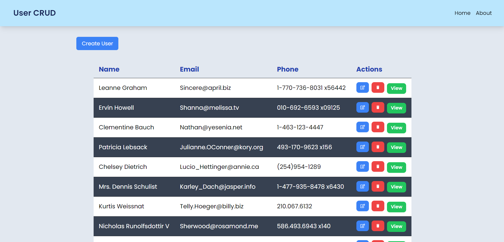

# User CRUD - Assignment Synergy Labs

User CRUD is a modern web application that demonstrates efficient data handling and user management using the latest technologies. This project showcases a user interface for managing users with functionalities for creating, reading, updating, and deleting (CRUD) user data.

## Live Demo and Repository

- Live Demo: **[User CRUD](https://user-crud-synergy.vercel.app/)**
- GitHub Repository: **[User CRUD](https://github.com/Shreykumar1/user-crud)**


## Technologies Used

- **React:** A JavaScript library for building user interfaces. React helps in creating reusable UI components and managing application state efficiently.
- **Vite:** A build tool that provides a fast development environment with lightning-fast hot module replacement (HMR). Vite is used to set up and manage the development workflow.
- **Tailwind CSS:** A utility-first CSS framework for styling the application. Tailwind CSS allows for rapid UI development with pre-defined classes for styling.
- **Daisy UI:** A Tailwind CSS framework for styling the application. daisy UI allows more functionality on top of tailwind.
- **TypeScript:** A superset of JavaScript that adds static types. TypeScript helps in writing more maintainable and error-free code by providing type safety.
- **React Icons:** A collection of popular icon libraries, used to integrate icons easily into the React application.
- **axios:** A promise-based HTTP client for making requests to the backend. Axios simplifies data fetching and handling.
- **react-router-dom:** A library for handling routing in React applications. It enables navigation between different views or pages within the application.

## Features

- **Fetch Data:** Retrieve user data from an external service and display it within the application.
- **CRUD Operations:** Implement Create, Read, Update, and Delete functionalities to manage user data effectively.

## How to Install and Run Locally

This project is built using Vite and React. Follow the steps below to run it locally:

1. Clone the repository:
   ```bash
   git clone https://github.com/amankashyap004/assignment-synergy-labs.git
   ```
2. Navigate to the project directory:
   ```bash
   cd assignment-synergy-labs
   ```
3. Install dependencies:
   ```bash
   npm install
   ```
4. Start the development server:
   ```bash
   npm run dev
   ```
5. Open your browser and go to `http://localhost:5173` to see the application in action.

## Screenshots

A sleek and modern homepage design showcasing.

